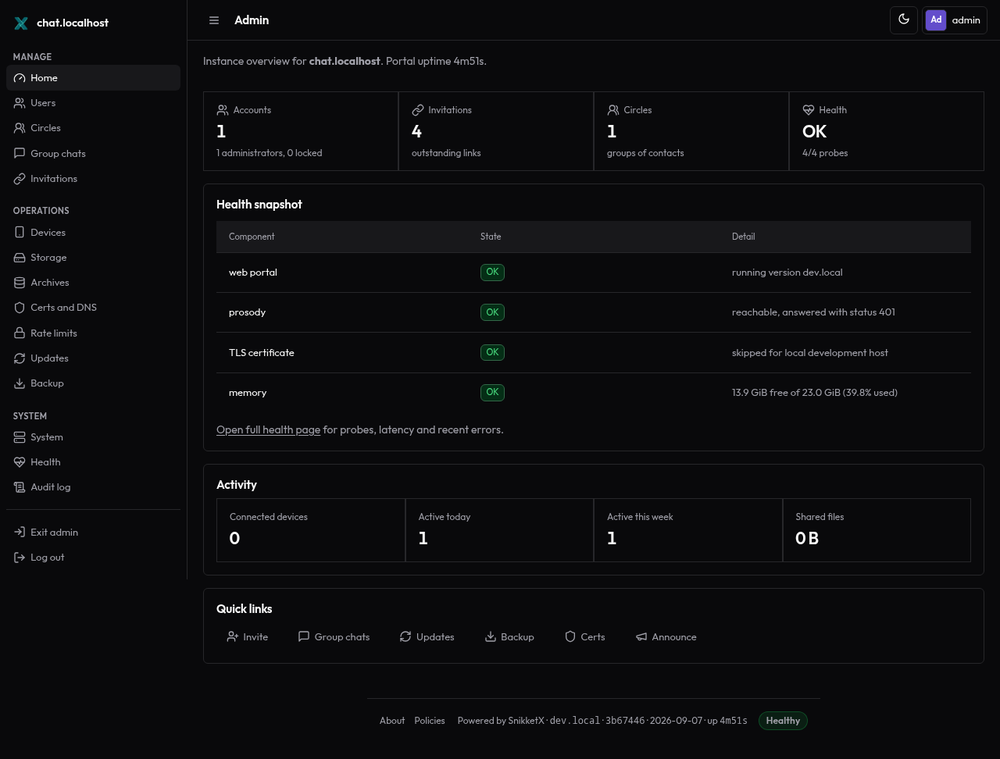

# snikketx

My Sloppulus fork of the Snikket stack as SnikketX in one repo: Prosody server image, web
portal, cert manager, plus RavenGuard on the HTTP edge.

Upstream lives at [snikket-im](https://github.com/snikket-im). This fork
publishes SnikketX images to GHCR under `ghcr.io/sudo-ivan/snikketx/`.



## Quick start

### Local development

```
make init-dev
make up-dev
```

Open http://chat.localhost:8080/login with `admin@chat.localhost` / `admin`.
Put `chat.localhost` in `/etc/hosts` as `127.0.0.1` if needed. HTTP edge is port **8080**.

### New production host

```
./scripts/init.sh
./scripts/preflight.sh
make up
./scripts/new-invite.sh --admin --group default
```

DNS must point the domain plus `share.` and `groups.` at this host. Ports **80/443** (HTTP), **5222/5269** (XMPP), **3478/5349** (STUN/TURN).

### Migrate from classic Snikket

Keeps Prosody data (accounts, MAM chats, MUCs, uploads). Always backups first.

```
make migrate FROM=/etc/snikket BACKUP_DIR=/var/backups/snikketx
```

Keep the classic directory until you trust the new stack. If migration fails:

```
make rollback FROM=/etc/snikket BACKUP_DIR=/var/backups/snikketx/snikketx-backup-TIMESTAMP
```

## Day-2 commands

| Command | Purpose |
|---------|---------|
| `make status` | Compose ps + login HTTP probe |
| `make logs` | Follow compose logs |
| `make admin` | Create/reset local admin (dev password `admin`) |
| `make invite` | Admin invite link |
| `make preflight` | Docker, DNS, ports, firewall hints |
| `make backup DEST=/abs/dir` | Full backup (data + config + SnikketX volumes) |
| `make restore ARCHIVE=/abs/snikket-data-....tar.gz` | Restore Prosody `/snikket` |
| `make down` / `make down-dev` | Stop stack |
| `make screenshot` | Refresh README dark dashboard shot |

Config files:

- `snikket.conf` — domain, admin email, LE TOS (from `snikket.conf.example`)
- `.env` — RavenGuard/updater secrets for Compose (from `.env.example` or `init`)

## Major changes from upstream

- One monorepo instead of separate Snikket packages (server, portal, cert-manager, proxy).
- HTTP edge is RavenGuard alone (TLS via ACME in prod). Traefik and the nginx web-proxy image are unused by default compose.
- Server, cert-manager, and web-proxy images build on Alpine 3.24. Prosody comes from apk (13.x), not Debian nightlies.
- Web portal is a stdlib Go single binary on distroless, not the upstream Python/Quart app, with a refreshed dark-mode admin panel (footer shows build metadata, uptime, and Healthy / Degraded / Down).
- Invite helpers use `prosodyctl shell invite` (create_account / create_reset). The old `mod_invites generate` path is gone.
- Publish pipeline signs images keyless with Cosign, attaches Syft SPDX SBOMs, runs Trivy and container smoke tests.

HTTP path:

```
Client -> RavenGuard (ACME TLS) -> web-portal
                                \-> Prosody HTTP (upload, BOSH, websocket)
XMPP/STUN/TURN -> snikket_server (direct ports)
```

RavenGuard runs as the first hop with `trust.mode = edge` and Let's Encrypt
(`tls.mode = acme`, TLS-ALPN-01). Path routes for Prosody and the certbot
HTTP-01 webroot are seeded into the RavenGuard admin store by
`scripts/seed-ravenguard-routes.sh`. The JS challenge stays off so XMPP
WebSocket clients are not blocked. See the
[intro](https://ravenguard.quad4.io/docs/intro) and
[configuration](https://ravenguard.quad4.io/docs/configuration) docs.

## Backup scope

`make backup DEST=/abs/dir` writes a timestamped directory with:

- `snikket-data-*.tar.gz` — entire `/snikket` volume (accounts, message archives, group chats, uploads, XMPP LE material)
- copies of `snikket.conf` and `.env`
- SnikketX-only volumes when present: portal, RavenGuard, updater

Classic Snikket used the same `/snikket` layout and container name `snikket`, so the data tarball is compatible for migrate/rollback.

## Layout

- `server/` - Prosody-based SnikketX server image
- `web-portal/` - account and admin web UI
- `updater/` - optional container update service
- `web-proxy/` - legacy nginx front door (not used by default compose)
- `cert-manager/` - Let's Encrypt for XMPP TLS (prod)
- `deploy/ravenguard/` - RavenGuard TOML and blocklists
- `deploy/migrate/` - volume override written by migrate script
- `scripts/` - install and ops helpers
- `docker-compose.yml` - production stack (pull GHCR + RavenGuard edge)
- `docker-compose.dev.yml` - local builds, no proxy/certs package

## Build images only

```
make docker
```

Images land as `ghcr.io/sudo-ivan/snikketx/{server,web-portal,web-proxy,cert-manager,updater}`.

Publish tags each image with mutable tags (`latest`, `dev`, `sha-<commit>`) and
records the immutable digest (`ghcr.io/sudo-ivan/snikketx/<component>@sha256:...`)
as a workflow artifact and job summary. Images are signed keyless with Cosign
(Sigstore) and get a Syft SPDX SBOM. CI also runs container smoke tests and
Trivy scans.

Verify a published digest:

```
cosign verify \
  --certificate-identity-regexp='https://github.com/Sudo-Ivan/snikketx/.*' \
  --certificate-oidc-issuer=https://token.actions.githubusercontent.com \
  ghcr.io/sudo-ivan/snikketx/server@sha256:<digest>
```

## License

Each package keeps its upstream license file. See `server/LICENSE`,
`web-portal/LICENSE`, and `web-proxy/LICENSE`.
